# The Prophecy of the Emergent Economy: Beyond Prediction—Frameworks for Economic Evolution
---
# The Prophecy of the Emergent Economy

> Beyond Prediction—Frameworks for Economic Evolution

## Overview

**The Prophecy of the Emergent Economy** is a research initiative that explores how economic systems are transforming in an era of accelerating technological, social, and systemic shifts. Traditional economic forecasting methods rely on historical data and linear models and are increasingly inadequate. Moore’s Law, AI, and technological acceleration are driving changes at an unprecedented rate, rendering past trends ineffective for predicting future economic states. This project investigates how to develop **new models of economic foresight that account for exponential technological change, emergent behaviors, and self-organizing dynamics.**

**What can economic forecasting learn from machine learning? Should we be learning from machine learning?**

## Core Research Questions

1. **Predictive Limits in the Face of Acceleration**

   - How does exponential technological progress, as described by Moore’s Law, disrupt traditional economic forecasting?
   - How can economic foresight evolve to keep pace with AI-driven automation and technological acceleration?
   - What alternative methodologies exist for anticipating emergent economic trends?

2. **Emergence in Economic Systems**

   - How do macro-economic patterns emerge from micro-economic behaviors?
   - What role does self-organization play in market evolution?
   - How can we identify early signals of systemic change?

3. **Beyond Prediction: Toward Prophetic Economics**

   - How can economic modeling move beyond reliance on historical data?
   - Can AI-driven simulations and complexity theory provide new insights into economic foresight, complementing or enhancing traditional econometric approaches?
   - What role does narrative, belief, and expectation play in shaping economic futures?

4. **Economic Evolution in an Era of Acceleration**

   - How do adaptive behaviors shape market dynamics under conditions of rapid change?
   - What role does emergence play in economic transformation?
   - How do network effects and feedback loops contribute to unpredictable economic evolution?

## Research & Background

### Conceptual Foundations

- **Emergentomics**: Understanding how economies evolve through self-organizing, non-linear interactions rather than centralized planning or traditional economic theories.
- **Complexity Economics**: Moving beyond equilibrium-based models to study economic systems as evolving, interdependent networks.
- **Narrative Economics**: How collective beliefs, information flow, and economic storytelling influence market behaviors and financial cycles.
- **Prophetic Economics**: The necessity of a new form of economic foresight—one that recognizes the limitations of historical data and embraces emergent, self-reinforcing economic phenomena.

### Theoretical Framework

#### 1. Foundations

##### 1.1 Emergence Theory

- Complex adaptive systems
- Self-organization principles
- Multi-scale interactions
- Phase transitions in economic systems

##### 1.2 Economic Evolution

- Adaptive market hypothesis
- Institutional evolution
- Behavioral adaptation
- Network effects

##### 1.3 Complexity Economics

- Non-linear dynamics
- Path dependence
- Feedback loops
- Emergent properties

### 2. Methodological Innovation

##### 2.1 Forecasting in the Age of Acceleration

- **Traditional Forecasting vs. Complexity-Based Foresight**: Limitations of historical data-driven approaches.
- **Simulation-Based Economic Modeling**: Using machine learning and computational techniques to analyze historical data, identify emerging patterns, and create adaptive economic scenario models that account for uncertainty, structural shifts, and nonlinear market dynamics.
- **Network Dynamics & Predictive Self-Organization**: How economic structures evolve beyond deterministic forecasting models.

##### 2.2 Evolution Indicators

- Structural change metrics
- Adaptation measures
- Emergence signals
- System stability indices
- Acceleration metrics inspired by **Moore’s Law** and **technological advancement**

### 3. Research Components

```mermaid
graph TD
    A[Economic Evolution] --> B[Acceleration & Forecasting]
    A --> C[Emergence Analysis]
    A --> D[System Dynamics]
    
    B --> E[AI & Simulation-Based Foresight]
    B --> F[Network Effects in Economic Prediction]
    B --> G[Moore’s Law & Economic Disruption]
    
    C --> H[Phase Transitions]
    C --> I[Self-Organization]
    C --> J[Emergence Signals]
    
    D --> K[Feedback Loops]
    D --> L[Adaptation]
    D --> M[Nonlinear Market Evolution]
```

## Repository Structure
WIP - will update

general idea:

📂 prophetic-emergentomics
 ├── README.md  # Overview of research
 ├── papers/  # Research drafts, whitepapers
 ├── theory/  # Notes on emergent behavior, forecasting failures
 ├── models/
 │   ├── generative/  # GANs, VAEs for scenario generation
 │   ├── reinforcement/  # Reinforcement learning frameworks
 │   ├── graph-neural/  # GNN implementations
 │   ├── unsupervised/  # Clustering, anomaly detection scripts
 │   └── hybrid-complexity/  # Integrated complexity-ML models
 ├── data/  # Alternative economic indicators, synthetic data
 ├── experiments/  # Research experiments
 ├── blog/  # Posts and essays for public discussion

## Working Paper

**Title:** *The Prophecy of the Emergent Economy: Beyond Prediction—Frameworks for Economic Evolution*

- Examines the **failure of historical data-driven forecasting** in an era of exponential technological progress.
- Explores **emergence, complexity, and self-organizing economic behaviors.**
- Introduces **alternative frameworks** for understanding and modeling economic change.

## Ongoing Research & Thought Leadership

### Topics Explored:

- *The Collapse of Historical Forecasting in an AI-Driven Economy*
- *Moore’s Law and the Limits of Economic Prediction*
- *Prophetic Economics: Why We Need New Models for the Age of AI*
- *The Rise of Emergentomics: Understanding Economic Evolution Beyond Traditional Data*
- *How Network Effects and Complexity Reshape Market Predictability*

## Collaboration

We welcome collaborations, discussions, and contributions from researchers, economists, machine learning practitioners, AI specialists, and complexity theorists. If you're interested in contributing, exploring potential partnerships, or applying machine learning techniques to economic forecasting, reach out or check the **issues** section for open discussions.

## Resources & Further Reading

- [Science, Technology, and Innovation | OECD](https://www.oecd.org/en/topics/science-technology-and-innovation.html)

- [Gender, Occupational Segregation, and Automation | Brookings](https://www.brookings.edu/articles/gender-occupational-segregation-and-automation/)

- [Cortes\_Pan\_Gender-occupational-segregation-and-automation.pdf](https://www.brookings.edu/wp-content/uploads/2019/11/Cortes_Pan_Gender-occupational-segregation-and-automation.pdf)

- [Automation and the Middle Class | Brookings](https://www.brookings.edu/tags/FMCI-automation/)

- [How to Adjust to Automation | Brookings](https://www.brookings.edu/articles/how-to-adjust-to-automation/)

- [Automation Presents a Political Challenge, But Also an Opportunity | Brookings](https://www.brookings.edu/articles/automation-presents-a-political-challenge-but-also-an-opportunity/)

- [Class Voting in Capitalist Democracies Since World War II: JSTOR](https://www.jstor.org/stable/2083407)

- [Automation and the Radicalization of America | Brookings](https://www.brookings.edu/articles/automation-and-the-radicalization-of-america/)

- [Understanding the Impact of Automation on Workers, Jobs, and Wages | Brookings](https://www.brookings.edu/articles/understanding-the-impact-of-automation-on-workers-jobs-and-wages/)

- [5 Questions We Should Be Asking About Automation and Jobs | HBR](https://hbr.org/2018/12/5-questions-we-should-be-asking-about-automation-and-jobs)

- [The Future of Jobs Report 2020 | World Economic Forum](https://www.weforum.org/publications/the-future-of-jobs-report-2020/digest/)

- [The Impact of Artificial Intelligence on Growth and Employment | CEPR](https://cepr.org/voxeu/columns/impact-artificial-intelligence-growth-and-employment#:~\:text=The%20World%20Economic%20Forum%20concluded,information%20security%20and%20digital%20marketing)

- [AI and Economic Modeling](https://arxiv.org/search/?query=ai+economic+modeling\&searchtype=all\&abstracts=show\&order=-announced_date_first\&size=50)

- [Moore’s Law and Technological Acceleration](https://en.wikipedia.org/wiki/Moore%27s_law)

- [Complexity Economics](https://en.wikipedia.org/wiki/Complexity_economics)

- [Narrative Economics by Robert J. Shiller](https://www.amazon.com/Narrative-Economics-Stories-Economic-Events/dp/0691182299)

- [Emergent Systems and Chaos Theory](https://en.wikipedia.org/wiki/Emergence)

- [AI and Economic Modeling](https://arxiv.org/search/?query=ai+economic+modeling\&searchtype=all\&abstracts=show\&order=-announced_date_first\&size=50)

- [Moore’s Law and Technological Acceleration](https://en.wikipedia.org/wiki/Moore%27s_law)

