# The Prophecy of the Emergent Economy: Beyond Prediction—Frameworks for Economic Evolution
---
# The Prophecy of the Emergent Economy

> Beyond Prediction—Frameworks for Economic Evolution

**WORKING PAPER**
Look out for updates as I add preliminary research, articles, pre-print, paper (working on it!), and code. 

## Overview

**The Prophecy of the Emergent Economy** is a research initiative that explores how economic systems are transforming in an era of accelerating technological, social, and systemic shifts. Traditional economic forecasting methods rely on historical data and linear models and are increasingly inadequate. Moore’s Law, AI, and technological acceleration are driving changes at an unprecedented rate, rendering past trends ineffective for predicting future economic states. This project investigates how to develop **new models of economic foresight that account for exponential technological change, emergent behaviors, and self-organizing dynamics.**

**What can economic forecasting learn from machine learning? Should we be learning from machine learning?**

## Motivation & Research Gap

Circling the possibilities and probabilities of the ‘Emergent Economy’ as it relates to unprecedented labor market circumstances, largely unrecognized as signals of a broader paradigm shift. The research explores how exponentially accelerating technological change remains under-interrogated, falling outside prevailing epistemic defaults and receiving limited institutional attention, and thus continues to elude recognition.

Economic forecasting is fundamentally misaligned with the systems it attempts to predict. The prevailing reliance on historical data and equilibrium models reflects a worldview that assumes continuity—yet our economic environment is shaped by rupture, recombination, and recursive feedback. Technological acceleration is not simply an external disruptor; it is endogenous, shaping the evolution of the very systems we are trying to forecast.

This project is grounded in the idea that most economic paradigms in use today are unable to account for rapid non-linear change. AI-driven automation, decentralized systems, and complex global interdependencies are not anomalies—they are the new structure of the economy. Yet current forecasting methods largely ignore emergent behavior, treating it as noise rather than signal.

The goal is to explore the construction of **post-linear economic foresight**: approaches that simulate evolution, learn from real-time signals, and integrate uncertainty as structure, not error. By combining techniques from machine learning, complexity theory, and systems modeling, the aim is to develop adaptive foresight frameworks that operate beyond traditional forecasting's epistemic constraints.

## Epistemological Premises

The project rests on a key epistemic assertion: that most dominant economic models are not only empirically fragile under conditions of systemic acceleration—they are also philosophically outdated. They assume closed systems, rational agents, and stationary dynamics. In contrast, this work assumes open systems, bounded rationality, and dynamic adaptation.

Forecasting has traditionally been treated as an act of extrapolation—finding signal in historical noise and projecting it forward. But in economies shaped by recursive feedback, cultural contagion, and evolving information ecologies, the very structure of signal and noise becomes unstable. This project views forecasting not as a prediction of a known future, but as a process of **structural inference under uncertainty**. It borrows epistemic humility from complexity science, while leveraging computational techniques that allow models to evolve with the systems they attempt to simulate.

## Forecasting Failures

Mainstream economic forecasting has failed repeatedly in the face of non-linear disruptions: the 2008 financial collapse, the labor shocks of the COVID-19 pandemic, and the emergent volatility of AI-driven productivity gains are all cases in point. These failures are not isolated. They reflect the limits of a toolkit optimized for incrementalism and disequipped for phase transitions.

Forecasts built on regression to mean, autoregressive models, and Gaussian assumptions consistently underestimate the frequency, scale, and propagation of systemic ruptures. This project investigates how these limitations are not simply technical but conceptual—and calls for a reframing of economic foresight as **non-equilibrium modeling** in complex, adaptive environments.

## Ontological Gaps in Economic Modeling

Certain patterns repeatedly go under-acknowledged in institutional models:
- **Latency of institutional response**: The lag between system-level shifts and their official recognition
- **Contagion effects**: Cascades of change that begin at the margins but amplify through connected systems
- **Emergent coordination**: Novel patterns of organization not predicted by agent-level rationality
- **Narrative asymmetry**: The outsized impact of belief, expectation, and memetics in determining economic behavior

These blindspots point to a deeper issue: our models fail not just because of statistical errors, but because of **ontological mismatch**. We model economies as if they are machines, when in reality, they behave more like ecologies. This project aims to move toward frameworks that reflect that truth.

## Framing Models: Toward Adaptive Economic Foresight

This repository will also contain the initial implementations of adaptive economic foresight models, developed and tested in modular experiments.

This work proposes a shift from forecasting as projection to modeling as *evolutionary simulation*. Instead of predicting a singular future from a stable past, we aim to explore multiple unfolding trajectories under varying assumptions, network topologies, feedback loops, and data environments.

To do this, we leverage tools that mirror the properties of the systems we study:

- **Graph Neural Networks** capture entangled relationships between actors, policies, markets, and institutions.
- **Reinforcement Learning agents** simulate policy experimentation and adaptation.
- **Transfer Learning** allows knowledge learned from past crises or historical parallels to be adapted for emerging economic forms.
- **Unsupervised Learning** helps detect regime shifts or phase transitions long before they manifest in aggregate statistics.
- **Hybrid Complexity Models** blend rule-based, agent-driven simulation with machine-learned emergent behaviors.

This isn’t just a methodological toolkit—it’s a philosophical stance: that foresight in complex systems must be iterative, non-deterministic, and sensitive to emergence.

If you’re working on adjacent problems or share these questions—or if you too feel existential—I’d be glad to connect.

## Core Research Questions

1. **Predictive Limits in the Face of Acceleration**
   
   - How does exponential technological progress, as described by Moore’s Law, disrupt traditional economic forecasting?
   - How can economic foresight evolve to keep pace with AI-driven automation and technological acceleration?
   - What alternative methodologies exist for anticipating emergent economic trends?

2. **Emergence in Economic Systems**
   
   - How do macro-economic patterns emerge from micro-economic behaviors?
   - What role does self-organization play in market evolution?
   - How can we identify early signals of systemic change?

3. **Beyond Prediction: Toward Prophetic Economics**
   
   - How can economic modeling move beyond reliance on historical data?
   - Can adaptive modeling environments grounded in complexity theory provide new insights into economic foresight, complementing or enhancing traditional econometric approaches?
   - What role does narrative, belief, and expectation play in shaping economic futures?

4. **Economic Evolution in an Era of Acceleration**
   
   - How do adaptive behaviors shape market dynamics under conditions of rapid change?
   - What role does emergence play in economic transformation?
   - How do network effects and feedback loops contribute to unpredictable economic evolution?

## Research & Background

### Theoretical Framework

#### 1. Foundations

##### 1.1 Emergence Theory

- Complex adaptive systems
- Self-organization principles
- Multi-scale interactions
- Phase transitions in economic systems

##### 1.2 Economic Evolution

- Adaptive market hypothesis
- Institutional evolution
- Behavioral adaptation
- Network effects

##### 1.3 Complexity Economics

- Non-linear dynamics
- Path dependence
- Feedback loops
- Emergent properties

### 2. Methodological Innovation

##### 2.1 Forecasting in the Age of Acceleration

- **Traditional Forecasting vs. Complexity-Based Foresight**: Limitations of historical data-driven approaches.
- **Simulation-Based Economic Modeling**: Using machine learning and computational techniques to analyze historical data, identify emerging patterns, and create adaptive economic scenario models that account for uncertainty, structural shifts, and nonlinear market dynamics.
- **Network Dynamics & Predictive Self-Organization**: How economic structures evolve beyond deterministic forecasting models.

##### 2.2 Evolution Indicators

- Structural change metrics
- Adaptation measures
- Emergence signals
- System stability indices
- Acceleration metrics inspired by **Moore’s Law** and **technological advancement**

##### 2.3 Machine Learning and Deep Learning for Emergent Forecasting

**Overview:**
While traditional econometric simulations often depend on historical data, ML and DL offer a suite of techniques that can adapt to new, unprecedented economic conditions by leveraging real-time data, transfer learning, and other innovative approaches. This section explores how advanced ML/DL methods can bridge the gap in economic forecasting by embracing complexity and adaptability without relying on synthetic data.

**Key Components:**

1. **Transfer Learning for Economic Adaptation:**
   - **Pre-trained Models:** Utilize models pre-trained on related economic datasets or domains to apply learned patterns to new, emerging contexts.
   - **Domain Adaptation:** Adapt models trained in one economic environment to function effectively in another, enabling quicker responsiveness to shifts.

2. **Real-Time Data Integration:**
   - **Streaming Data Analytics:** Incorporate real-time data streams from sources such as financial markets, social media, IoT devices, and other digital platforms to enhance the timeliness and relevance of forecasts.
   - **Dynamic Feature Engineering:** Continuously update feature sets based on incoming data to capture the most current economic indicators and trends.

3. **Reinforcement Learning for Adaptive Forecasting:**
   - **Adaptive Policies:** Implement reinforcement learning agents that refine their forecasting strategies in response to real-time data and emerging patterns.
   - **Dynamic Environment Modeling:** Use reinforcement learning to model economic environments as dynamic systems, where policies and interventions evolve based on feedback.

4. **Graph Neural Networks (GNNs) for Interconnected Economies:**
   - **Network Topology Analysis:** Apply GNNs to understand and predict the impact of interconnections within economic networks, capturing the complexity of global supply chains, financial systems, and labor markets.
   - **Propagation of Shocks:** Model how economic shocks propagate through interconnected networks, enabling more accurate forecasting of systemic risks and cascading effects.

5. **Unsupervised Learning for Emergence Detection:**
   - **Clustering and Anomaly Detection:** Use unsupervised learning techniques to identify emerging clusters, trends, and anomalies that signify shifts in economic behavior or structure.
   - **Dimensionality Reduction:** Apply techniques like t-SNE or UMAP to visualize high-dimensional economic data, uncovering hidden patterns that inform forecasting models.

6. **Hybrid Models Integrating ML/DL with Complexity Theory:**
   - **Complex Systems Integration:** Combine ML/DL models with principles from complexity economics to account for non-linear interactions, feedback loops, and adaptive behaviors in economic systems.
   - **Agent-Based Modeling Enhancements:** Enhance agent-based models with ML-driven behaviors, allowing agents to learn and adapt based on simulated economic environments.

**Applications:**

- **Labor Market Dynamics:** Forecasting shifts in labor demand and supply by modeling emergent trends influenced by automation, AI, and societal changes.
- **Interconnected Market Forecasting:** Predicting how changes in one sector affect others through complex interdependencies and network effects.
- **Policy Impact Simulation:** Assessing the potential outcomes of economic policies in unprecedented scenarios, accounting for emergent behaviors and adaptive responses.

**Challenges and Considerations:**

- **Data Quality and Diversity:** Ensuring the integration of high-quality, diverse real-time data sources to enhance model accuracy and robustness.
- **Model Interpretability:** Maintaining the interpretability of complex ML/DL models to facilitate informed decision-making by policymakers and stakeholders.
- **Computational Resources:** Managing the computational demands of advanced ML/DL models, especially when dealing with large-scale, interconnected economic data.

## 3. Research Components

```mermaid
graph TD
    A[Economic Evolution] --> B[Acceleration & Forecasting]
    A --> C[Emergence Analysis]
    A --> D[System Dynamics]
    A --> N[ML/DL for Emergent Forecasting]

    B --> E[Learning-Based Structural Modeling]
    B --> F[Network Effects in Economic Prediction]
    B --> G[Moore’s Law & Economic Disruption]

    C --> H[Phase Transitions]
    C --> I[Self-Organization]
    C --> J[Emergence Signals]

    D --> K[Feedback Loops]
    D --> L[Adaptation]
    D --> M[Nonlinear Market Evolution]

    N --> O[Transfer Learning]
    N --> P[Real-Time Data Integration]
    N --> Q[Reinforcement Learning]
    N --> R[Graph Neural Networks]
    N --> S[Unsupervised Learning]
    N --> T[Hybrid Complexity-ML Models]
```




**General Guide:**

```
📂 prophetic-emergentomics
 ├── README.md  # Overview of research
 ├── papers/  # Research drafts, whitepapers
 ├── theory/  # Notes on emergent behavior, forecasting failures
 ├── models/
 │   ├── transfer-learning/  # Transfer learning frameworks
 │   ├── real-time-data/  # Real-time data integration scripts
 │   ├── reinforcement/  # Reinforcement learning frameworks
 │   ├── graph-neural/  # GNN implementations
 │   ├── unsupervised/  # Clustering, anomaly detection scripts
 │   └── hybrid-complexity/  # Integrated complexity-ML models
 ├── data/  # Real-time economic indicators, diverse data sources
 ├── experiments/  # Research experiments
 ├── blog/  # Posts and essays for public discussion
```

## Working Paper

**Title:** *The Prophecy of the Emergent Economy: Beyond Prediction—Frameworks for Economic Evolution*

- Examines the **failure of historical data-driven forecasting** in an era of exponential technological progress.
- Explores **emergence, complexity, and self-organizing economic behaviors.**
- Introduces **alternative frameworks** for understanding and modeling economic change.

### Abstract

The current draft of this paper examines the limitations of historical data-driven forecasting in an era marked by exponential technological progress and systemic transformations. It explores the roles of emergence, complexity, and self-organizing behaviors in shaping economic systems. The study introduces advanced machine learning and deep learning methodologies that transcend traditional predictive models, offering new frameworks for economic foresight that accommodate uncertainty, non-linearity, and adaptive dynamics without relying on synthetic data. This is subject to change, I can't possibly point out the rate at which technology advances, and stand on my view that we must *attempt* to keep up (or at least not get more than a decade behind) without *trying* to update my research, experiments, and code accordingly.

### Key Sections

1. **Introduction**
   - Background and significance
   - Limitations of traditional forecasting

2. **Theoretical Foundations**
   - Emergence Theory
   - Complexity Economics
   - Prophetic Economics

3. **Methodological Innovations**
   - Traditional Forecasting vs. Complexity-Based Foresight
   - ML/DL Techniques for Emergent Forecasting
     - Transfer Learning
     - Real-Time Data Integration
     - Reinforcement Learning
     - Graph Neural Networks
     - Unsupervised Learning
     - Hybrid Models

4. **Applications and Case Studies**
   - Labor Market Dynamics
   - Interconnected Market Forecasting
   - Policy Impact Simulation

5. **Challenges and Future Directions**
   - Data Quality and Diversity
   - Model Interpretability
   - Computational Considerations

6. **Conclusion**
   - Summary of findings
   - Implications for economic forecasting

## Ongoing Research & Thoughts 
#### Some call it *Thought Leadership,* but Maybe it's Maybelline

### Subjects Currently Probing

- *Beyond Static Forecasting: Learning Systems for Emergent Economies*
- *Transfer Learning and Real-Time Data Integration in Predicting Unprecedented Economic Trends*
- *Reinforcement Learning in Adaptive Economic Policy Simulation*
- *Graph Neural Networks for Mapping and Predicting Interconnected Market Dynamics*
- *Unsupervised Learning Techniques for Detecting Economic Phase Transitions*
- *Enhancing Economic Forecasts with Real-Time and Diverse Data Sources*

## Author’s Note: Perspective & Approach

This research is driven by the conviction that many of the most pressing economic shifts are **not adequately legible** to current institutional frameworks. Rather than attempting to retrofit emerging complexity into legacy paradigms, this project takes the stance that we must build new cognitive tools—ones that are adaptive, system-aware, and narrative-literate.

The term *Prophetic Economics* is not meant to imply mysticism, but to reclaim the word “prophetic” as an epistemic stance: forward-looking, grounded in pattern recognition, capable of integrating uncertainty, ambiguity, and change as core inputs rather than outliers.

I am building this repository as both a **research lab notebook** and a **conceptual declaration**—a place for ideas-in-progress, experiments, models, and provocations.

## Conceptual Lexicon

These terms are under development and may evolve as the work deepens.

_Programmers enjoy creative outlets too (and not just when naming functions)._

- **Emergentomics**: Understanding how economies evolve through self-organizing, non-linear interactions rather than centralized planning or traditional economic theories.
- **Complexity Economics**: Moving beyond equilibrium-based models to study economic systems as evolving, interdependent networks.
- **Narrative Economics**: How collective beliefs, information flow, and economic storytelling influence market behaviors and financial cycles.
- **Prophetic Economics**: The necessity of a new form of economic foresight—one that recognizes the limitations of historical data and embraces emergent, self-reinforcing economic phenomena.

*I'm not Merriam Webster, so these are subject to change, but it's just a draft anyway.*

## Implementation Plan (Research & Code)

This repository is structured as both a conceptual framework and a functional pipeline. It will include model prototypes, simulation environments, and modular experiments to explore structural emergence, economic adaptation, and forecasting breakdowns under complexity.

### Components to Be Developed

- **/models/** – Baseline implementations of:
  - Transfer learning on economic domains
  - Real-time data ingestion and featurization pipelines
  - Reinforcement learning for adaptive policy experimentation
  - Graph neural networks capturing cross-sector dependencies
  - Unsupervised clustering and anomaly detection modules
  - Hybrid models integrating agent-based logic with ML adaptation

- **/experiments/** – Scenario-driven simulations and falsification environments
- **/data/** – Curated indicators and real-time sources (economic, behavioral, sentiment-based)
- **/theory/** – Exploratory writing and notes on emergent behavior, breakdowns in traditional forecasting, and philosophical questions of epistemology and ontology
- **/blog/** – Public-facing commentary, technical breakdowns, provocations, and evolving thoughts

This is not a closed framework—it’s an iterative, epistemologically experimental system. Contributions are welcome, especially from those working across complexity science, economic modeling, ML research, or structural epistemology.

## Collaboration

We welcome collaborations, discussions, and contributions from researchers, economists, machine learning practitioners, AI specialists, and complexity theorists. If you’re interested in contributing, exploring potential partnerships, or applying machine learning techniques to economic forecasting, reach out or check the **issues** section for open discussions.


## Final Note

This project doesn’t aim to solve the forecasting problem. It questions whether forecasting, as we know it, is even the right frame.

It’s an attempt to trace the outlines of systems in motion—systems that defy reduction, resist projection, and evolve faster than our models can capture. It leans into uncertainty not as failure, but as structure. The goal isn’t prediction. It’s orientation.

If this feels familiar—if you've noticed the cracks forming between metrics and meaning, between institutional models and lived complexity—you’re not alone. This repository is a scaffolding, a starting point. Not a destination.

The work is unfinished. It has to be.

*-- Vanessa Beck / stochastic-sisyphus*

---

## Appendix: Further Reading & Influences

- [Science, Technology, and Innovation | OECD](https://www.oecd.org/en/topics/science-technology-and-innovation.html)
- [Gender, Occupational Segregation, and Automation | Brookings](https://www.brookings.edu/articles/gender-occupational-segregation-and-automation/)
- [Cortes_Pan_Gender-occupational-segregation-and-automation.pdf](https://www.brookings.edu/wp-content/uploads/2019/11/Cortes_Pan_Gender-occupational-segregation-and-automation.pdf)
- [Automation and the Middle Class | Brookings](https://www.brookings.edu/tags/FMCI-automation/)
- [How to Adjust to Automation | Brookings](https://www.brookings.edu/articles/how-to-adjust-to-automation/)
- [Automation Presents a Political Challenge, But Also an Opportunity | Brookings](https://www.brookings.edu/articles/automation-presents-a-political-challenge-but-also-an-opportunity/)
- [Class Voting in Capitalist Democracies Since World War II: JSTOR](https://www.jstor.org/stable/2083407)
- [Automation and the Radicalization of America | Brookings](https://www.brookings.edu/articles/automation-and-the-radicalization-of-america/)
- [Understanding the Impact of Automation on Workers, Jobs, and Wages | Brookings](https://www.brookings.edu/articles/understanding-the-impact-of-automation-on-workers-jobs-and-wages/)
- [5 Questions We Should Be Asking About Automation and Jobs | HBR](https://hbr.org/2018/12/5-questions-we-should-be-asking-about-automation-and-jobs)
- [The Future of Jobs Report 2020 | World Economic Forum](https://www.weforum.org/publications/the-future-of-jobs-report-2020/digest/)
- [The Impact of Artificial Intelligence on Growth and Employment | CEPR](https://cepr.org/voxeu/columns/impact-artificial-intelligence-growth-and-employment)
- [AI and Economic Modeling](https://arxiv.org/search/?query=ai+economic+modeling&searchtype=all&abstracts=show&order=-announced_date_first&size=50)
- [Moore’s Law and Technological Acceleration](https://en.wikipedia.org/wiki/Moore%27s_law)
- [Complexity Economics](https://en.wikipedia.org/wiki/Complexity_economics)
- [Narrative Economics by Robert J. Shiller](https://www.amazon.com/Narrative-Economics-Stories-Economic-Events/dp/0691182299)
- [Emergent Systems and Chaos Theory](https://en.wikipedia.org/wiki/Emergence)
